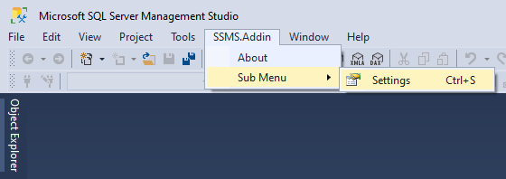
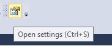
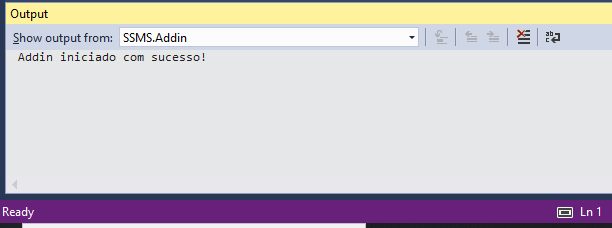
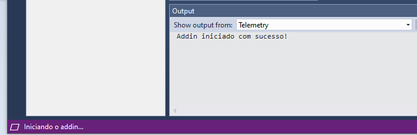
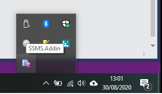
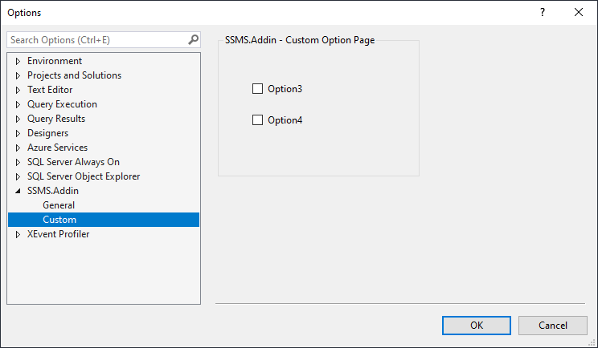
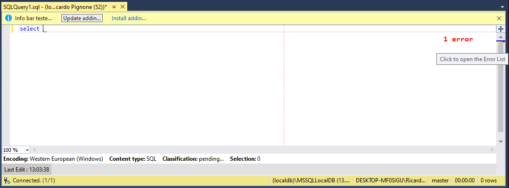

### **FEATURES**

**Main Menu**

Allows you to create menus on the main bar or on other existing menus.
You do not need to create the .vsct file and use * ProvideMenuResource ("Menus.ctmenu", 1)] *. Uses interface * IVsProfferCommands3 * to create commands dynamically.

	

**ToolBox**

Allows you to create a toolbox.

	
**Object Explorer ContextMenu**

It allows the creation of a context menu for objects (database, table, etc.). It is possible to use several resources to navigate between the nodes of the object tree.

**OutputWindow**

Allows you to create several customized output panels. Send messages to the output panels as Logs.

**StatusBar** 

Allows you to send messages to the status bar, start animation with icons.

**TrayIcon**
	
Allows you to create an icon in the windows tray with click events and context menus.

**Configuração**

It allows the creation of configuration pages using the Grid standard or using custom controls.

**Document**

It allows the creation of information bar, personalized status bar, adorments and other resources.

