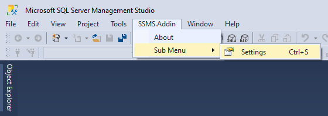
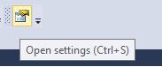
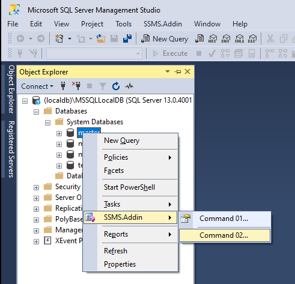
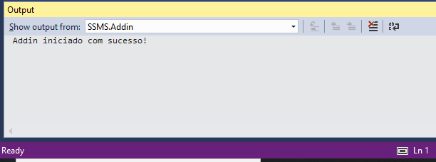
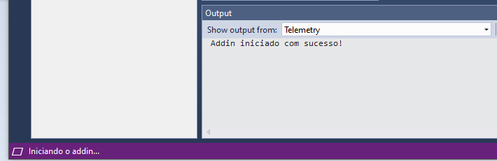
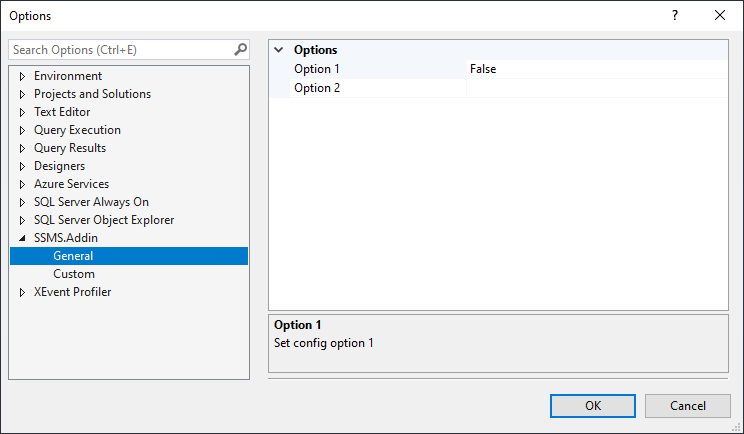
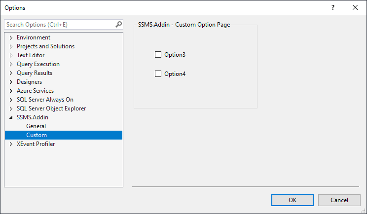

### **FUNCIONALIDADES**

**Menu Principal**

Permite criar menus na barra principal ou em ,outros menus existentes. 
Não necessita de criar o arquivo  .vsct e utilizar  *ProvideMenuResource("Menus.ctmenu", 1)]*. Utiliza interface *IVsProfferCommands3* para criação dos commandos dinamicamente.

	

**ToolBox**

Permite criar toolbox.

	
**Object Explorer ContextMenu**

Permite a criação de menu de contexto para objetos (database, table, etc). Possível utilizar varios recursos para navegar entres os nós da arvore de  objetos.

**OutputWindow**

Permite criar vários paineis de saída personalizados.  Enviar mensagens para os paineis de saída como Logs. 

**StatusBar** 

Permite enviar mensagens para a barra de status, iniciar animação com ícones.

**TrayIcon**
	
Permite criar um icone na bandeja do windows com  eventos de click e menus de contexto.

**Configuração**

Permite a criação de paginas de configuração utilizando o padrão Grid ou utilizando controles personalizados

**Document**

Permite a criação de barra de informação, barra de status personalizada, adorments e outros recursos.

